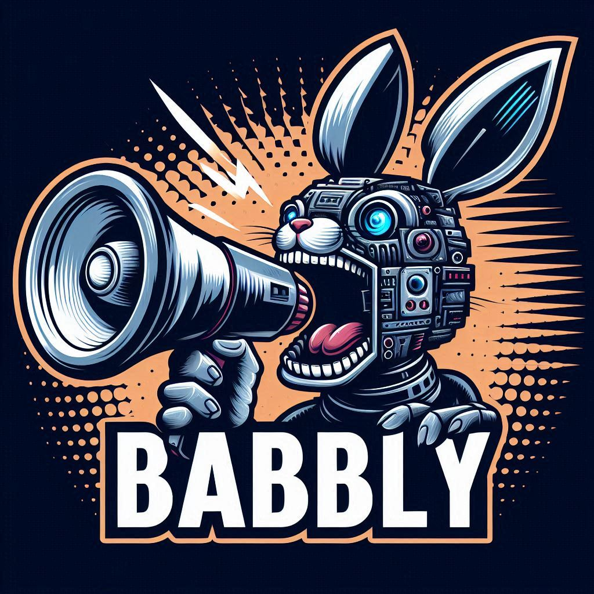

# Babbly


## Overview of Tools

**Babbly** is a penetration testing support tool featuring **Artificial Incompetence**. Instead of relying on cloud AI, it achieves intuitive dialogue-based operation through natural language processing and voice recognition. Supporting eyes-free and hands-free operation, security tests can be efficiently performed alongside other tasks since they can be executed through voice commands alone without checking the screen. With its human-like conversational interface, it's easy for beginners to use and offers high flexibility.

The current next-generation work is evolving Babbly into a reusable **offline operator-assistance system**. The migration keeps the original deterministic/SOP model while adding pluggable offline ASR, Japanese normalization, domain vocabulary packs, confidence-aware intent routing, explicit clarification, a shared Situation Model, profile-driven agent identity/persona, and a dry-run validation mode.

The long-term design objective is to **preserve operator situational awareness**. Babbly should let the operator use a visual surface when attention is available and move seamlessly to eyes-free / hands-free interaction when attention must remain on the surrounding environment. Visual and voice interaction must share the same canonical intents, task state, SituationSnapshot, safety policy, and authority boundaries. A forearm-mounted smartphone is treated as a future Babbly EUD presentation surface, not as a replacement for Babbly Core.

See [`docs/offline-asr.md`](docs/offline-asr.md), [`docs/situation-model.md`](docs/situation-model.md), [`docs/agent-profiles.md`](docs/agent-profiles.md), and [`docs/OPERATOR_INTERACTION_CONCEPT.md`](docs/OPERATOR_INTERACTION_CONCEPT.md).

「**Babbly**」は**人工無能**（**Artificial Incompetence**）を特徴とするペネトレーションテスト支援ツールです。クラウドAIに依存せず、自然言語処理と音声認識により直感的な対話型操作を実現します。アイズフリー・ハンズフリーに対応し、音声指示だけでテストを実行できるため、画面確認なしで他の作業と並行して効率的なセキュリティテストが可能です。

現在は次世代化として、Babblyを再利用可能な**オフライン・オペレータ支援システム**へ進化させています。従来の決定論的なSOPモデルを維持しつつ、差し替え可能なオフラインASR、日本語正規化、ドメイン語彙、信頼度ベースのIntent判定、明示的な聞き返し、Situation Model、Agent Profile、DRY RUN検証を追加しています。

最終的な設計目標は、**操作者のSituational Awarenessを維持すること**です。余裕がある状況ではEUD/TUI/Webを視覚的に利用し、周囲への警戒や別作業を優先する必要がある状況では、同じタスク状態のまま音声中心のアイズフリー・ハンズフリー操作へ移行します。視覚操作と音声操作は別系統にせず、同一のIntent、Situation Model、安全ポリシー、権限境界を共有します。

## North-star interaction concept

Babbly is not intended to become a voice-controlled arbitrary shell or an autonomous tactical decision-maker. Voice, TUI, web, and future wearable interfaces are input/presentation surfaces over the same core.

The planned interaction model uses operator-controlled attention states:

- **NORMAL** — visual-first, detailed information available
- **HEADS_UP** — reduced visual density, voice preferred
- **CRITICAL** — eyes-free / hands-free operation assumed, concise output and the same execution safeguards retained

Attention state is separate from threat severity. Switching mode changes presentation and interaction cost; it must never weaken confirmation requirements, execution policy, or external-system authority.

See [`docs/OPERATOR_INTERACTION_CONCEPT.md`](docs/OPERATOR_INTERACTION_CONCEPT.md) for the complete design direction and [`docs/ROADMAP_2X.md`](docs/ROADMAP_2X.md) for the implementation path.

## Agent profiles

Babbly is the framework; the operator-facing agent can change by environment.

```text
generic / kali      -> Babbly（バブリー）
azazel-edge         -> M.I.O（ミオ）
```

Examples:

```bash
./run_babbly.sh ja --profile generic
./run_babbly.sh ja --profile azazel-edge
BABBLY_PROFILE=azazel-edge ./run_babbly.sh ja
```

The `azazel-edge` profile selects the M.I.O identity, the `ミオ` wake phrase, a concise tactical persona, Azazel vocabulary, and the existing read-only Azazel-Edge situation adapter. Profiles cannot change execution policy, intent thresholds, DRY_RUN, command registries, or Azazel-Edge decision authority.

See [`docs/agent-profiles.md`](docs/agent-profiles.md).

## Development workflow

Babbly is developed **MacBook-first**. The current reference development host is a MacBook Pro with M5 Pro; Raspberry Pi is the later deployment/hardware-validation target. Core logic, NLU, policy, adapters, dry-run behavior, profiles, and development benchmarks should pass on the Mac before Pi-specific audio/resource validation.

```bash
python3 -m venv .venv
source .venv/bin/activate
./run_babbly.sh test
./run_babbly.sh ja --profile generic
```

See [`docs/development-macos.md`](docs/development-macos.md) for setup, the Mac-to-Pi promotion gate, and the platform-aware development benchmark flow.

## Changelog

Notable changes are recorded in [`CHANGELOG.md`](CHANGELOG.md), following
[Keep a Changelog](https://keepachangelog.com/) and Semantic Versioning.

### [日本語モード](babbly/ja/README.md)

日本語を使用するユーザは、こちらのリンクをご確認ください。

### [English mode](babbly/en/README.md)

For users who use English, please check this link.

---

## Babbly's image character


